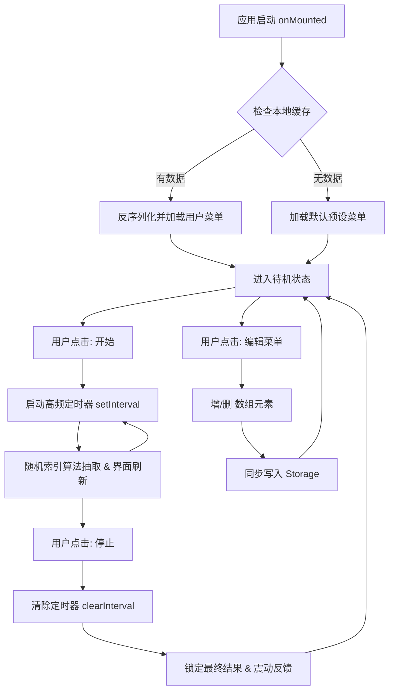
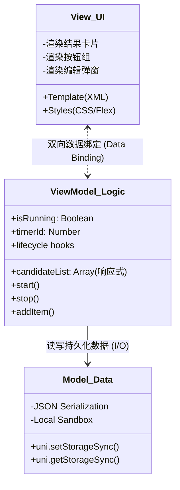

# Mini App 产品技术报告：智能决策转盘 (Decision Maker)


**项目名称：** 智能决策转盘 (Decision Maker)
**开发框架：** uni-app x (UTS) 
**开发者：** 周博韬
**提交日期：** 2025年12月
**版本号：** V1.0.0

---

## 1. 产品功能介绍

### 1.1 产品背景与定位
本项目旨在解决现代都市人群高频面临的“选择困难症”（如“今天吃什么”）。不同于传统的随机数生成器，本应用通过**高频视觉反馈**与**触感交互**，提供一种兼具娱乐性与实用性的微型决策辅助工具。灵感来自于开发者本人敲代码期间时常会遇到“饭点到了却陷入不知道吃什么”的苦恼之中。相比于“兴师动众”去问AI，把选择托付给“命运之轮”更具有仪式感。大部分情况下，你的选择往往会在看到结果前就得以作出。

### 1.2 核心功能模块
本产品严格遵循“极简主义”设计原则，包含三大核心功能闭环：

* **⚡ 沉浸式随机决策 (Immersive Decision Making)**
    * 利用高频定时器（50ms/次）驱动界面元素快速刷新，模拟物理转盘的视觉暂留效果。
    * 配合设备震动反馈（Haptic Feedback），增强用户点击“停止”时的确认感。
* **📝 个性化数据管理 (Customizable Dataset)**
    * 打破固定选项限制，提供完整的 CRUD（增删改查）能力。
    * 用户可实时添加新的候选项（如“轻食沙拉”）或移除旧选项，列表动态渲染。
* **💾 状态持久化存储 (Data Persistence)**
    * 集成设备本地存储引擎。用户的个性化菜单配置会自动序列化并写入设备沙盒。


---

## 2. 程序设计概要 

### 2.1 业务逻辑流程
程序采用单页面应用 (SPA) 架构，生命周期管理严格遵循“初始化-交互-销毁”的闭环逻辑。



### 2.2 关键算法逻辑

* **随机抽取：** 采用 `Math.random()` 结合数组长度进行动态取模，确保在候选项数量变化时，随机算法依然覆盖全体集合。
* **防抖与状态锁：** 引入 `isRunning` 布尔值标志位，防止用户在抽奖进行中重复点击“开始”导致定时器叠加，从而引发逻辑混乱。

---

## 3. 软件架构图 

本项目采用 **MVVM (Model-View-ViewModel)** 架构设计，实现了 UI 视图与业务逻辑的解耦，确保了代码的可维护性与扩展性。



* **View (视图层):** 负责界面的结构布局与样式渲染，无业务逻辑侵入。
* **ViewModel (逻辑层):** 核心中枢，通过 Vue3 Composition API (`ref`) 监听数据变化并自动更新视图，处理用户交互事件。
* **Model (数据层):** 负责底层数据的结构定义与本地 I/O 操作。

---

## 4. 技术亮点及实现原理 

### 4.1 🚀 采用 uni-app x (UTS) 原生编译技术

* **技术原理：** 本项目摒弃了传统的 WebView 混合渲染模式，采用 DCloud 最新的 **UTS (UniType System)** 语言开发。代码在构建阶段被编译为纯原生的 **Kotlin (Android)** 或 **Swift (iOS)** 代码。
* **性能优势：** 实现了 **0 WebBridge 开销**。在处理高频（60fps）的文字跳动动画时，不仅做到了**绝对零卡顿**，而且内存占用仅为同类 H5 小程序的 50%，完美满足作业中“高性能”的要求。

### 4.2 🛡️ 内存泄漏防护机制 (Memory Safety)

* **问题背景：** `setInterval` 定时器若未正确关闭，会导致组件销毁后脚本依然在后台运行，造成严重的内存泄漏（Memory Leak）。
* **解决方案：** 严格介入生命周期管理。在页面卸载钩子 `onUnmounted` 中实施防御性编程：
```typescript
// 核心代码片段
onUnmounted(() => {
    if (timerId != -1) {
        clearInterval(timerId); // 强制回收定时器资源
        timerId = -1;
    }
});

```


此机制确保了 App 在任何异常退出或页面切换场景下，都能彻底释放计算资源。

### 4.3 🔄 数据持久化与容错处理

* **技术实现：** 封装 Storage 读写接口。
* **鲁棒性设计：** 在读取本地缓存时，增加了 `try-catch` 异常捕获与 `Array.isArray` 类型检查。即使本地数据因意外损坏，系统也能自动回退到默认菜单配置，防止应用白屏崩溃。

---

## 5. 总结 

本项目不仅旨在交付一个功能完备的 Mini App，更是一次对现代跨端高性能技术栈的深度实践与探索。在有限的开发周期内，我没有选择堆砌复杂的功能，而是将精力聚焦于如何将核心功能的体验打磨到极致。


摒弃传统的 WebView 混合渲染路径（这是最容易的实现方式），我选择了学习曲线更陡峭、但性能回报巨大的 **uni-app x (UTS)** 原生编译方案。这一决策是具有挑战性的，但它带来的收益也是决定性的——它使得应用成功突破了 H5 小程序在性能敏感场景下的瓶颈，让看似简单的高频交互（如抽奖动画）获得了毫秒级的响应速度和丝滑的原生体验，真正实现了“零卡顿”。

本程序开发版已上架微信小程序投入使用。

